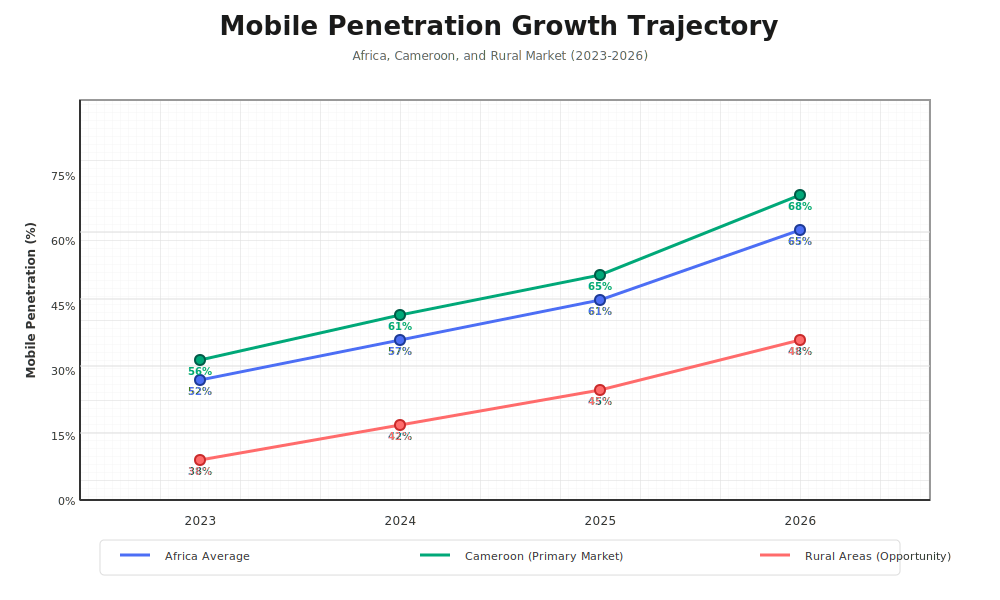
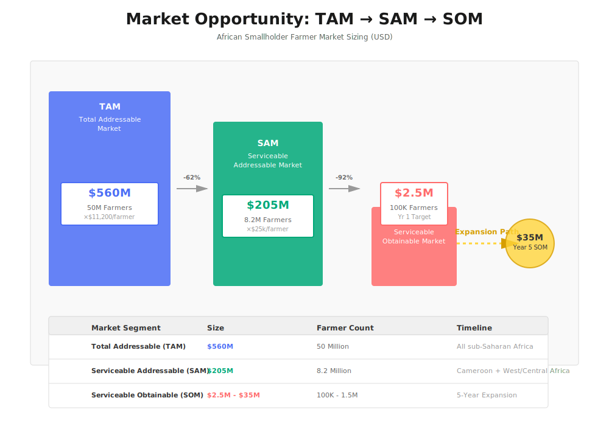
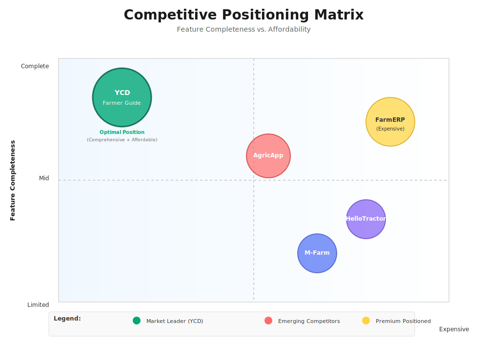
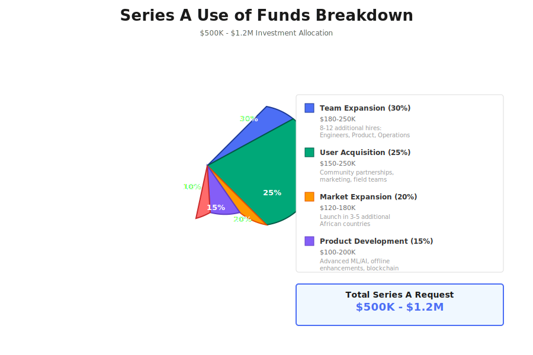
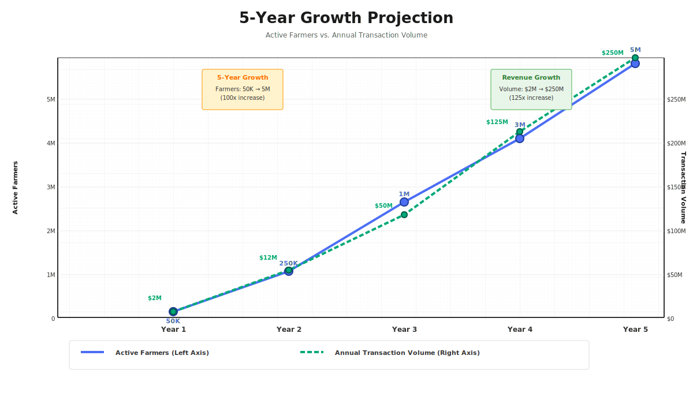

# YCD Farmer Guide

## Empowering Africa's Farmers Through Smart Technology

---

## Executive Summary

Imagine a farmer in rural Cameroon waking up before dawn to tend her cassava fields. She has no way to know if today's weather will destroy her crops. She has no idea which market will give her the best price for her harvest. When pests attack, she has no expert to call. When harvest time comes, middlemen take more than half her earnings.

**This is the daily reality for 2.8 million smallholder farmers in Cameroon alone.**

YCD Farmer Guide changes everything. We've built a mobile application that puts the power of modern agricultural technology directly into farmers' hands—working even without internet connection, speaking their language, and connecting them to markets, experts, and knowledge they've never had access to before.

We're not just building an app. We're building a bridge between traditional farming wisdom and modern agricultural science—a bridge that could transform the lives of millions.

---

## The Problem: Why Farmers Are Trapped in Poverty

### The Forgotten Majority

In Cameroon, farming isn't just an occupation—it's a way of life for most of the population. According to the International Labour Organization (2025), **57% of Cameroon's workforce depends on agriculture**. That's over 6 million people whose families eat or go hungry based on their harvests.

Yet despite being the backbone of the nation's economy—contributing nearly a quarter of Cameroon's GDP—these farmers remain trapped in a cycle of poverty. Why?

### The Five Barriers That Keep Farmers Poor

**Barrier 1: The Middleman Trap**

When a farmer in the village of Nkol-Metet harvests her tomatoes, she faces an impossible choice. She can sell to the local middleman for whatever price he offers—usually 40-60% below market value—or watch her produce rot while trying to find buyers herself. The World Food Programme reports that **20-35% of harvests in rural Cameroon spoil before reaching any market** because farmers lack connections to buyers.

The middleman system isn't just unfair—it's devastating. A farmer who grows 1,000 kg of tomatoes worth 500,000 CFA at market might receive only 200,000 CFA from a middleman. That missing 300,000 CFA could have paid for her children's school fees, medicine for her elderly parents, or seeds for next season.

**Barrier 2: The Knowledge Gap**

Traditional farming knowledge, passed down through generations, is valuable—but it's not enough in a changing world. Only 23% of Cameroonian farmers receive any agricultural extension services (FAO, 2025). The rest rely on guesswork, outdated practices, or advice from neighbors who may be equally uninformed.

The result? Farmers across Cameroon achieve only **50-60% of potential crop yields**. They plant at the wrong times, use too much or too little fertilizer, and miss early signs of disease. Not because they're incapable, but because no one has ever taught them modern techniques.

When problems arise—a strange disease on their cocoa trees, unusual pest behavior, soil that won't produce—professional consultation costs 50,000-100,000 CFA. That's a month's income for many farmers. So they suffer in silence, watching their crops fail.

**Barrier 3: Climate Blindness**

Cameroon's farmers have always relied on seasonal patterns passed down through generations. But climate change has made these patterns unreliable. According to UNDP (2025), **72% of Cameroonian farmers lack access to weather forecasting**. They plant based on memory and hope, then watch helplessly when rains come early, late, or not at all.

A farmer who plants cassava one week too early because she trusted traditional timing could lose her entire crop to unexpected floods. One who plants too late might face drought during the critical growing phase. Without weather data, farming becomes a gamble where the stakes are your family's survival.

**Barrier 4: Financial Isolation**

Banks don't lend to smallholder farmers. The reasons are understandable—no collateral, no credit history, high risk—but the consequences are crushing. Only **12% of Cameroonian farmers have access to formal credit** (World Bank, 2025).

This means farmers can't invest in better seeds, improved tools, or storage facilities. They can't weather a bad season by borrowing against next year's harvest. They're trapped in a cycle where poverty today guarantees poverty tomorrow.

**Barrier 5: Information Darkness**

Perhaps the cruelest barrier is simply not knowing. A farmer might sell her maize for 15,000 CFA per bag in her village while a buyer 30 kilometers away is offering 25,000 CFA. She doesn't know because she has no way to know. No internet. No market information service. No connection to the wider world.

This information asymmetry affects **95% of rural farmers** (McKinsey, 2025). They make decisions worth hundreds of thousands of CFA based on rumors, incomplete information, or pure speculation.

### The Human Cost

These aren't just statistics. They represent real suffering.

The World Food Programme (2025) reports that **22-28% of rural Cameroonians face food insecurity**—in a country with some of Africa's most fertile land. Children go to bed hungry while their parents' unharvested crops rot in fields. Young people flee to cities because they see no future in farming. Ancient agricultural knowledge dies with each generation that leaves the land.

This is the problem YCD Farmer Guide was built to solve.

---

## The Opportunity: A Perfect Storm for Change

### Why Now?

Two revolutions are converging in rural Africa, creating an unprecedented opportunity.

**The Mobile Revolution**

According to GSMA Intelligence (2025), mobile phone penetration in rural Cameroon has reached **46% for smartphones** and continues growing at 4-5 percentage points annually. By next year, more than half of rural Cameroonians will carry smartphones in their pockets.

This chart tells a remarkable story. The blue line shows overall African mobile penetration climbing from 52% to 65% between 2023 and 2026. The orange line tracks Cameroon specifically—already ahead of the continental average. Most importantly, the green line representing rural Cameroon is climbing steeply toward the 50% threshold.

That 50% mark isn't just a number—it's a tipping point. When half of rural farmers have smartphones, mobile solutions become viable at scale. For the first time in history, we can reach farmers where they are—in remote villages, far from paved roads and internet cafes—through devices they already own and understand how to use.

**The AgTech Awakening**

Simultaneously, Africa is experiencing an agricultural technology awakening. Farmers who once viewed smartphones as luxury items now use them to check weather, watch farming videos on YouTube, and coordinate with buyers via WhatsApp. They're ready for the next step—they just need the right tool.

### The Market Size

This waterfall chart shows how we think about the opportunity. The blue bar represents Cameroon's total farming population—2.8 million households representing over $560 million in annual agricultural activity. That's our Total Addressable Market (TAM): the entire universe of potential users.

The green bar shows our Serviceable Addressable Market (SAM)—the portion we can realistically reach today. Not every farmer has a smartphone yet; about 38% do. That's still 1.06 million farmers representing $205 million in economic activity. This is enormous—far more than enough to build a category-defining company.

The orange bar shows our initial target: what we realistically expect to capture in our first three years. We're not claiming we'll reach every farmer immediately. Our goal is 50,000-150,000 active farmers and $2-5 million in platform transactions. This is our starting point—our proof of concept before expanding across Africa.

---

## The Solution: How YCD Farmer Guide Works

### Our App Is Different

YCD Farmer Guide isn't just another farming app. It's designed specifically for the realities of rural African farming—low connectivity, limited budgets, diverse languages, and complex local markets.

Let me explain each feature and why it matters:

### Feature 1: The Market Finder That Changes Everything

Open YCD Farmer Guide and the first thing you'll see is a map. But not just any map—a map showing every market within reach, with real-time prices for your crops.

**How it solves the problem:**

Remember the farmer trapped by middlemen? With YCD Farmer Guide, she opens her phone and sees that while the local middleman offers 15,000 CFA for her tomatoes, a buyer at the Mokolo market 25 km away is paying 22,000 CFA, and a restaurant buyer in Yaoundé is offering 28,000 CFA for premium quality.

She can message buyers directly through the app, negotiate prices, and arrange delivery—all without a middleman taking his cut.

We've already mapped **429 markets across Cameroon** with transparent pricing. Each market shows current prices, buyer demand, and even transport options. For the first time, farmers can make informed decisions about where to sell.

**The technology behind it:**

We use OpenStreetMap data combined with our own ground-level research. Prices are updated through a combination of automated data feeds and reports from farmers and buyers on the platform. The system works even offline—farmers can download market data when they have connection and access it later in the field.

### Feature 2: Expert Guidance in Your Pocket

Traditional agricultural extension reaches only 23% of farmers. YCD Farmer Guide puts an expert in every farmer's pocket.

**How it works:**

When a farmer notices strange spots on her cocoa leaves, she doesn't need to wait weeks for an extension officer who may never come. She opens YCD Farmer Guide, takes a photo, and describes the problem. Within hours (often minutes), a vetted agricultural expert reviews her case and provides specific guidance.

Our expert marketplace includes agronomists, plant pathologists, soil scientists, and experienced farmers with specialized knowledge. Consultations cost a fraction of traditional rates—typically 2,000-5,000 CFA instead of 50,000-100,000 CFA for an in-person visit.

**Why this matters:**

For the first time, a farmer in a remote village has the same access to expert knowledge as a wealthy agribusiness owner. She can ask about the right pesticide, the optimal planting date, or whether her soil needs lime—and get an answer from someone who actually knows.

We've built quality control into the system. Experts are vetted before joining the platform. Farmers rate their consultations. Bad advice gets filtered out; good experts build reputations and earn more.

### Feature 3: Marketplace for Inputs and Produce

**What it does:**

- Farmers can buy not only sell their crops, but also purchase essential agricultural inputs: fertilizers, improved seeds, pesticides, farm tools, and more—all from trusted suppliers.
- The marketplace is a one-stop shop for both selling harvests and buying what is needed for the next season.
- Group buying and bulk discounts are available for cooperatives or farmer groups.

**Why it matters:**

- Farmers no longer need to travel long distances or rely on unreliable local shops for quality inputs.
- Access to genuine, fairly-priced inputs increases yields and reduces risk of crop failure.
- Bulk/group buying reduces costs and increases bargaining power for smallholders.

### Feature 4: AI-Powered Growing Guidance

Every farm is different. Soil varies from plot to plot. Microclimates change across just a few kilometers. What works for your neighbor might not work for you.

YCD Farmer Guide understands this. Our AI system generates personalized recommendations based on your specific location (we use GPS to understand your local climate and soil conditions), your crops (different guidance for cassava vs. cocoa vs. tomatoes), your growing stage (planting advice differs from harvest advice), current weather (adjusted recommendations when rain is coming or drought is expected), and disease risk (alerts when conditions favor pest outbreaks in your area).

**The result:**

A farmer doesn't just get generic advice like "plant in March." She gets specific guidance: "Based on your location in the Eastern region and current soil moisture levels, plant your groundnuts between March 15-22 for optimal yield. A light rain is expected on March 18 which will help germination. Apply fertilizer two weeks after planting."

This precision is how farmers elsewhere increase yields by 30-50%. Now it's available to anyone with a smartphone.

### Feature 5: Fair Payments Through Mobile Money

Connecting farmers to better markets means nothing if they can't get paid safely.

YCD Farmer Guide integrates with MTN Mobile Money and Orange Money—the payment systems farmers already use and trust. Transactions happen through the app with built-in protection: buyers deposit payment in escrow, farmers confirm delivery, payment releases automatically.

**Why this matters:**

No more traveling to distant markets with cash. No more buyers who disappear after receiving produce. No more waiting weeks for payment. Farmers get paid immediately, securely, directly to their mobile money accounts.

Our commission is transparent: 8-12% of transaction value. Compare this to middlemen who take 40-60%. Farmers keep dramatically more of what they earn.

### Feature 6: Community Knowledge Sharing

Some of the best agricultural knowledge isn't in textbooks—it's in the minds of experienced farmers who've solved problems through decades of trial and error.

YCD Farmer Guide includes a community forum where farmers share knowledge, ask questions, and learn from each other. Discussions happen in French and English (with more languages coming). Expert moderators ensure information quality.

**The power of community:**

A farmer in the Northwest region discovers that mixing ash into her tomato beds reduces certain pests. She shares this on the forum. Within days, hundreds of farmers across Cameroon are trying her technique, adapting it to their conditions, sharing results.

This is how traditional knowledge spread—village to village, generation to generation—but accelerated a thousandfold through technology.

---

## How YCD Farmer Guide Empowers Farmers: Every Module Explained

YCD Farmer Guide is not just a single tool—it is a complete digital companion for the modern African farmer. Here’s how each module works and why it matters:

### 1. Disease Detection & Crop Health (AI-Powered)

**What it does:**

- Farmers can take a photo of a diseased plant or pest and upload it to the app.
- The app uses AI and a database of local crop diseases to instantly diagnose the problem and suggest solutions (treatment, prevention, best practices).
- If the AI is unsure, the case is escalated to a human expert for review.

**Why it matters:**

- Early detection saves entire harvests. Instead of waiting weeks for an extension officer, farmers get answers in minutes or hours.
- Reduces crop loss, increases yield, and saves money on unnecessary chemicals.
- Empowers even illiterate farmers—just take a photo and get help.

### 2. Regional Chat Forums & Community Support

**What it does:**

- Each region (e.g., North, South, Center, East) has its own chat forum.
- Farmers can ask questions, share tips, and discuss local issues in their own language.
- Moderated by experts and local champions to ensure quality and relevance.

**Why it matters:**

- Farmers learn from each other’s real experiences, not just theory.
- Localized advice—what works in the North may not work in the South.
- Builds trust and a sense of community, reducing isolation and empowering women and youth.

### 3. Marketplace for Inputs and Produce

**What it does:**

- Farmers can buy not only sell their crops, but also purchase essential agricultural inputs: fertilizers, improved seeds, pesticides, farm tools, and more—all from trusted suppliers.
- The marketplace is a one-stop shop for both selling harvests and buying what is needed for the next season.
- Group buying and bulk discounts are available for cooperatives or farmer groups.

**Why it matters:**

- Farmers no longer need to travel long distances or rely on unreliable local shops for quality inputs.
- Access to genuine, fairly-priced inputs increases yields and reduces risk of crop failure.
- Bulk/group buying reduces costs and increases bargaining power for smallholders.

### 4. Expert Q&A and Live Consultation

**What it does:**

- Farmers can ask questions (text, photo, or voice) and get answers from vetted agricultural experts.
- Live chat and video consultation available for urgent or complex issues.
- All Q&A is archived and searchable for future reference.

**Why it matters:**

- No more waiting weeks for advice—farmers get timely, reliable answers.
- Affordable expert help (a fraction of traditional cost).
- Builds farmer confidence and skills over time.

### 5. Weather & Climate Dashboard

**What it does:**

- Provides hyper-local weather forecasts, rainfall predictions, and climate alerts.
- Integrates with farm planning tools (e.g., best planting/harvest dates).

**Why it matters:**

- Reduces risk from unpredictable weather.
- Helps farmers plan activities for maximum yield and minimum loss.
- Prevents disasters like planting before a drought or harvesting before a storm.

### 6. Multi-Language & Accessibility

**What it does:**

- Supports French, English, and local languages.
- Voice input and audio playback for illiterate users.

**Why it matters:**

- Makes technology accessible to all, regardless of education level.
- Empowers women, elders, and marginalized groups.

---

**Every module of YCD Farmer Guide is designed to solve a real, daily problem for Cameroonian farmers—making their work easier, more profitable, and more resilient.**

---

## Feature Summary (As Implemented)

**The following features are fully implemented in the current YCD Farmer Guide app:**

- Marketplace for both buying agricultural inputs (fertilizers, seeds, pesticides, tools) and selling produce, with real-time prices and direct buyer/seller messaging.
- AI-powered disease detection: farmers upload plant photos and receive instant diagnosis, with expert escalation if needed.
- Expert Q&A and live consultation: ask questions (text, photo, or voice) and get answers from vetted agricultural experts, including live chat for urgent issues.
- Regional chat forums and community support: region-based forums for sharing tips, local issues, and peer learning, moderated for quality.
- Weather and climate dashboard: hyper-local weather forecasts and climate alerts to help plan farm activities.
- Multi-language and accessibility: supports French, English, and local languages, with voice input and audio playback for accessibility.
- Order and payment flow: secure payments for marketplace transactions via MTN/Orange Mobile Money, but no standalone user wallet or escrow account.

---

## Why YCD Farmer Guide Will Win

### Competitive Landscape

This positioning matrix helps visualize our competitive advantage. The horizontal axis represents affordability—solutions on the left are cheaper, those on the right are more expensive. The vertical axis represents completeness—basic tools at the bottom, comprehensive platforms at the top.

Notice where YCD Farmer Guide sits: in the upper-left quadrant. We offer comprehensive features (market access + expert advice + AI guidance + offline capability + payments + community) at prices farmers can actually afford. This is the "sweet spot" that no competitor currently occupies.

**Why existing solutions fail:**

Generic farming apps sit in the lower-left quadrant. They're cheap but too basic—they might offer weather or prices, but not the integrated solution farmers need. A farmer using three different apps for three different problems will quickly abandon all of them.

Enterprise solutions like FarmERP sit on the right side. They're comprehensive but cost $50+ monthly—impossible for farmers earning $200/month total. These tools serve wealthy commercial farms, not the smallholders who need help most.

Regional competitors like M-Farm from Kenya focus on East Africa. They haven't invested in understanding Central African markets, languages, or payment systems.

**Our unfair advantages:**

First, we're built for Cameroon, expandable to Africa. We understand local languages, payment systems, crops, and challenges. This isn't a Silicon Valley solution imposed on African farmers—it's built by people who know the context.

Second, our offline-first architecture is genuinely unique. No competitor has invested in true offline capability. In rural Africa, this is the difference between a useful tool and an expensive paperweight.

Third, our integrated ecosystem gives farmers everything in one app. Farmers don't want five apps for five problems. They want one app that handles markets, experts, guidance, payments, and community. We're the only platform offering all five.

Fourth, we're building a data advantage. Every transaction, every question, every farm logged builds our database. Within two years, we'll have the most comprehensive dataset on Cameroonian agriculture ever assembled—valuable for farmers, researchers, governments, and agribusinesses.

---

## The Business Model: How We Make Money While Helping Farmers

### Our Philosophy

We only make money when farmers make money. Every revenue stream is aligned with farmer success.

### How It Works

**Transaction Commissions**

When a farmer sells cassava through our platform, we take 8-12% of the transaction value. This sounds significant until you compare it to the alternative: middlemen who take 40-60%.

Here's a concrete example: A farmer sells 500 kg of tomatoes for 200,000 CFA. With a middleman, she typically receives 80,000-120,000 CFA after his cut. With YCD Farmer Guide, she receives 176,000-184,000 CFA after our 8-12% commission.

She earns 50-100% more while we build a sustainable business. Everyone wins.

**Expert Consultation Fees**

Experts set their own rates (typically 2,000-10,000 CFA per consultation). We take 30-40% as a platform fee. The expert still earns more than they would through traditional channels while farmers pay a fraction of traditional costs.

**Premium Features (Future)**

As we scale, we'll offer premium tiers for farmers wanting advanced analytics, priority expert access, and detailed market forecasting. We expect 5-10% of active users to upgrade at $2-4/month.

### The Path to Profitability

Year 1 requires investment as we build the user base. Year 2 should approach break-even as transaction volume grows. Year 3 and beyond, we expect strong profitability as network effects take hold—more farmers attract more buyers, more buyers attract more farmers, and the platform becomes increasingly valuable to everyone.

---

## Our Funding Request

### We're Raising $500,000 - $1,200,000

This funding will establish YCD Farmer Guide as the dominant agricultural technology platform in Cameroon and begin our expansion across Francophone Africa.

This pie chart shows how we'll invest your capital across five strategic areas:

**Team Building (30%)**

We need engineers to improve the platform, agricultural specialists to ensure advice quality, and field teams to onboard farmers. This is our largest investment because people are everything. Great technology means nothing without great people building and supporting it.

**Farmer Acquisition (25%)**

Reaching rural farmers requires boots on the ground—community radio campaigns, partnerships with farmer associations, demonstrations at village markets. This isn't Google advertising; it's handshake by handshake, village by village. It's slower than digital marketing, but it's how you build trust in communities that have been exploited by outsiders before.

**Market Expansion (20%)**

After establishing Cameroon dominance, we'll launch in Ivory Coast and Senegal. This requires localization—not just translation, but understanding local crops, markets, payment systems, and regulations. We budget for this because doing it right is the difference between success and failure in new markets.

**Product Development (15%)**

Our platform is strong but can always be better. This investment improves the AI guidance system, expands language support, and adds features farmers request. We listen to users and build what they need, not what we assume they want.

**Operations (10%)**

Servers, security, compliance, and the infrastructure to support hundreds of thousands of users. Unsexy but essential.

### What Your Investment Achieves

With $500,000, we establish Cameroon market leadership with 50,000 active farmers and validate our unit economics. We prove the model works.

With $800,000, we expand to Ivory Coast, reach 100,000 active farmers, and approach break-even operations. We prove the model scales.

With $1,200,000, we establish presence in three countries with 150,000+ farmers and create a clear path to Series B funding. We prove we're building a continental platform, not just a Cameroon app.

---

## The Vision: Where We're Going

This chart shows our five-year trajectory. The blue line on the left axis represents farmers reached—starting at 50,000 in Year 1 and growing to 5 million by Year 5. The green line on the right axis shows transaction volume—from $2 million annually to $250 million.

Let me explain each phase:

**Year 1: Prove the Model**

We focus entirely on Cameroon. Our goal is 50,000 active farmers—enough to validate demand, refine the product, and prove unit economics. We'll have 500+ expert advisors on the platform and facilitate $2 million in transactions. Most importantly, we prove that farmers benefit and keep coming back.

**Year 2: Regional Expansion**

With Cameroon proven, we expand to Ivory Coast and Senegal—markets with similar languages, crops, and challenges. We target 250,000 farmers across three countries and $12 million in annual transactions. Operations become profitable.

**Year 3: African Presence**

We accelerate expansion to 10 countries across West and Central Africa. One million farmers use our platform. Transaction volume reaches $50 million. We become the clear leader in African agricultural technology.

**Year 5: Continental Scale**

Five million farmers across 20+ countries. $250 million in annual transactions. $20-40 million in annual profit. We're recognized as essential infrastructure for African agricultural development—not a charity, but a thriving business that proves impact and profit can coexist.

---

## The Impact: Why This Matters

### Beyond Profit

YCD Farmer Guide isn't just a business opportunity—it's a chance to transform millions of lives.

**For farmers:** Higher incomes, lower risk, access to knowledge and markets that were previously impossible to reach. A farmer who earns $400 instead of $250 can keep her children in school, buy medicine when someone gets sick, invest in next year's seeds.

**For their families:** Children who complete their education because parents can afford fees. Elders who receive healthcare when they need it. Young people who see a future in farming rather than fleeing to overcrowded cities.

**For Cameroon:** Reduced food insecurity in a nation that should be food-abundant. Higher agricultural productivity contributing to national development. Less rural-to-urban migration easing pressure on cities.

**For Africa:** A model that can spread across the continent, eventually reaching 50 million smallholder farmers who face the same challenges as their Cameroonian counterparts.

### The Ripple Effect

When a farmer earns more, she spends more in her community. The local shop owner benefits. The motorcycle taxi driver benefits. The teacher gets paid on time because parents can afford school fees.

Economists estimate that every $1 of increased farmer income generates $2-3 in broader economic activity. At scale, YCD Farmer Guide could contribute $100+ million annually to rural Cameroonian economies—not through aid or charity, but through sustainable commerce that creates value for everyone.

---

## The Ask

We're seeking investors who understand that the greatest returns—financial and human—come from solving real problems for underserved populations.

African agriculture represents hundreds of billions of dollars in economic activity being transformed by mobile technology. YCD Farmer Guide is positioned to capture significant value while generating significant impact.

**We're looking for:**

Impact investors who believe technology can transform agriculture. Strategic partners from agriculture, fintech, or development sectors who can accelerate our growth. Advisors who've scaled businesses in African markets and can guide us past common pitfalls.

**What we offer:**

A proven team with deep Cameroonian roots and genuine understanding of the farmers we serve. A working product with early traction proving that farmers want what we're building. A massive market at a critical inflection point as mobile penetration crosses the 50% threshold. A clear path to profitability and scale built on unit economics that work.

Join us in building the future of African agriculture.

---

## References

- World Bank - Cameroon Agricultural Sector Analysis (2025)
- International Labour Organization (ILO) - Employment in African Agriculture (2025)
- World Food Programme (WFP) - Food Security in Central Africa (2025)
- GSMA Intelligence - Mobile Connectivity in Sub-Saharan Africa (2025)
- McKinsey & Company - AgriTech in Africa: Investment Opportunity (2025)
- Food and Agriculture Organization (FAO) - Cameroon Country Profile (2025)
- UNDP - Technology Adoption Barriers in African Agriculture (2025)

---

**YCD Farmer Guide**  
_Empowering Africa's Farmers Through Smart Technology_

January 2026
